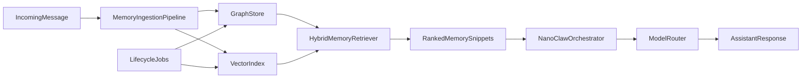

## Goal

Design a graph-first memory system for NanoClaw on an Infomaniak VPS that scales to long-term personal usage, keeps operating cost under control, supports prompt/config-driven retrieval behavior, and is ready for future model routing.

## Updated Recommendation

- **Primary choice**: Use **Zep Graphiti** (from the issue list) as the graph-memory service.
- **Fallback choice**: Use **Mem0** only if you decide to prioritize implementation speed over graph-native modeling.
- **Data model**: Temporal knowledge graph with entities, relationships, episodes, provenance, and timestamps.
- **Retrieval**: Hybrid retrieval (graph traversal + semantic/vector + recency/importance ranking), with runtime-selectable retrieval profiles.
- **Cost control**: Keep core services self-hosted on the VPS, enforce token budgets per turn, and use tiered memory (hot/warm/cold).
- **Future model routing**: Build a memory-provider abstraction now so you can route extraction/embedding/reasoning to different models later.

## Service Decision From Original List

- **Pick now**: **Zep/Graphiti**.
- **Why this one**:
  - It is explicitly graph-native and temporal, which matches your long-term "store a lot of info" goal.
  - It fits your VPS/self-hosting preference better than managed-heavy stacks.
  - It supports better relationship-aware retrieval than markdown-centric systems.
- **Why not the others as primary**:
  - **Mem0**: strong and practical, but typically more memory-layer abstraction than strict graph-first source of truth.
  - **Letta/MemGPT**: elegant agent memory model, but heavier operationally and can add latency.
  - **Hindsight/Nemori/A-MEM/TiMem**: promising research direction, but higher implementation risk for a first production deployment.

## Why this matches your constraints

- You expect **large memory growth**, so explicit graph relationships and temporal reasoning are better than file-link heuristics.
- You want **decent performance with low cost**, so self-hosted graph+vector services on a VPS avoid vendor lock-in and recurring managed-service bills.
- You want to **tweak behavior via prompt/config**, so retrieval profiles should be first-class runtime settings.

## Target Architecture

## Retrieval Profiles (prompt/config selectable)

- **fast**: shallow graph hops, low top-K, strict token cap.
- **balanced**: moderate traversal depth + semantic reranking.
- **deep**: broader neighborhood expansion, stronger reranking, larger memory budget.

These profiles should be selectable via a per-group/per-task setting and optionally overridden by message hints in the prompt.

## Implementation Plan

- **Phase 1 - Memory provider abstraction in NanoClaw**
  - Add a `MemoryProvider` contract in the orchestrator boundary:
    - `ingestEvent(event)`
    - `retrieve(queryContext, profile)`
    - `updateMemory(memoryId, patch)`
    - `compactAndArchive()`
  - Keep the orchestrator independent of the concrete graph framework.
- **Phase 2 - Graph backend deployment on VPS**
  - Deploy a graph-capable memory framework stack on Infomaniak VPS.
  - Add persistence, backups, and service health checks.
  - Configure baseline retention and resource limits.
- **Phase 3 - Ingestion + identity resolution**
  - Convert incoming messages and events into memory episodes.
  - Extract entities, relations, and temporal metadata.
  - Add dedup/conflict rules (same entity across sessions/channels).
- **Phase 4 - Hybrid retrieval integration**
  - Implement retrieval hook before model invocation in `src/index.ts`.
  - Query graph + vector, then rerank with recency/importance/task relevance.
  - Inject compact snippets under a strict per-turn token budget.
- **Phase 5 - Lifecycle management**
  - Add scheduled jobs (via `src/task-scheduler.ts`) for:
    - Decay/reinforcement scoring.
    - Consolidation of fragmented memories into higher-level abstractions.
    - Archival of stale low-value nodes to cold storage.
- **Phase 6 - Observability and guardrails**
  - Track retrieval latency, retrieved-node counts, memory-token budget usage, and hit quality.
  - Add admin/debug commands (e.g. memory inspect/search/explain) to verify retrieval decisions.
- **Phase 7 - Model routing readiness**
  - Route memory subtasks independently:
    - extraction model
    - embedding model
    - retrieval-summarization model
    - final reasoning model
  - Start with single-provider defaults and leave routing policy in config.

## Tooling Decision

- **Most adapted direction for you**: a **framework graph memory stack** with a clean abstraction in NanoClaw.
- **Not recommended as primary**: markdown-only or markdown+SQLite as the final target for your use case.
- **Pragmatic fallback**: keep markdown export/snapshots for portability and disaster recovery, but not as the primary live memory engine.

## Risks and mitigations

- **Operational complexity**: graph systems are heavier than files; mitigate via one framework and strict interface boundaries.
- **Retrieval drift/noise**: mitigate with profile-based retrieval controls and explicit token budgets.
- **Cost creep from model calls**: mitigate with model routing and caching for repeated retrieval summaries.

